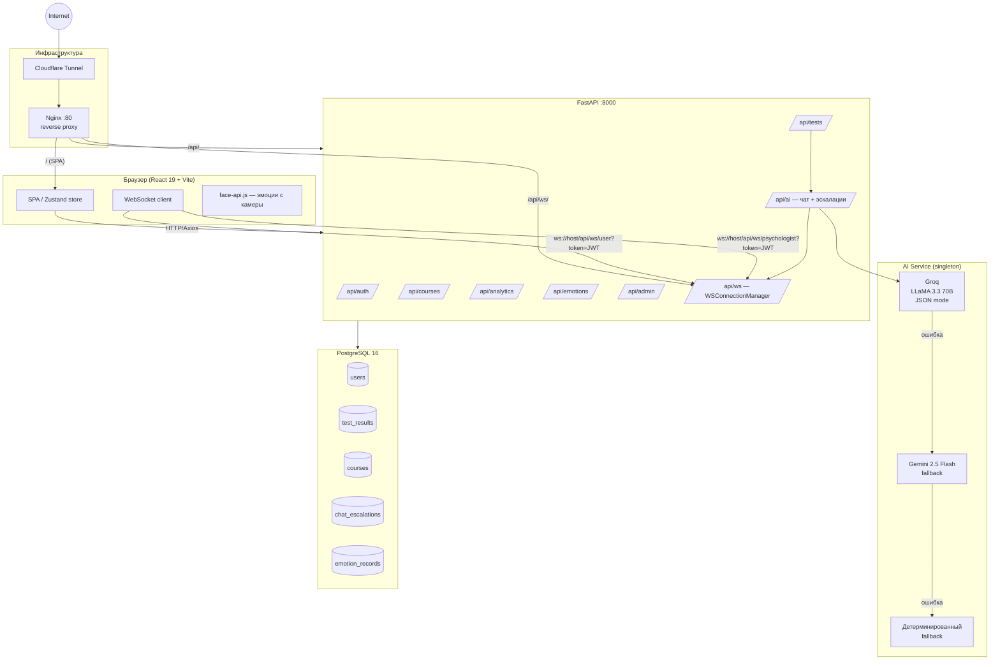
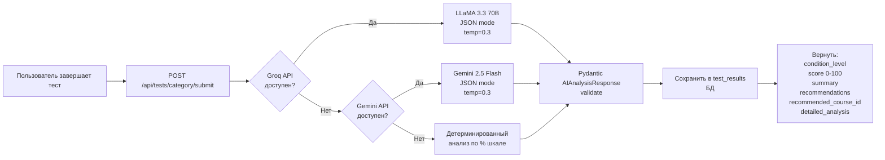
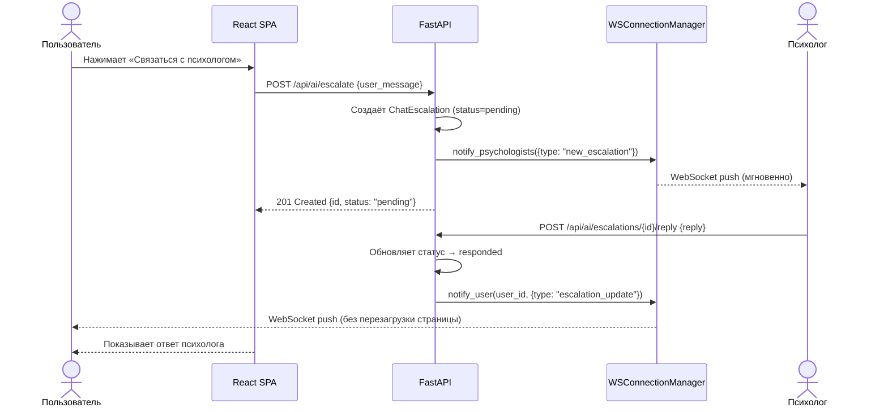
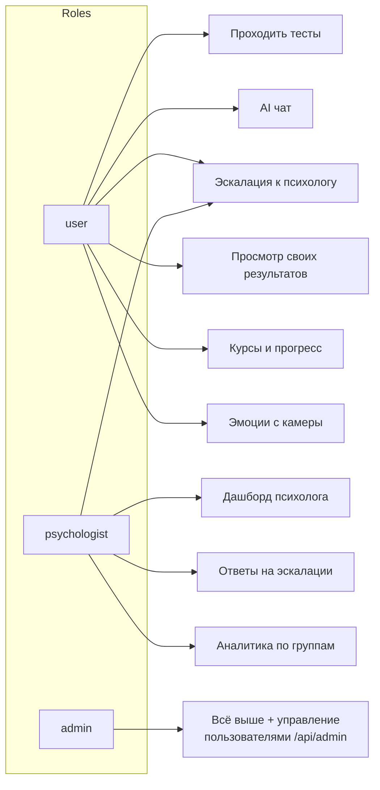

# PsyPlatform — Платформа психоэмоционального здоровья

Корпоративная платформа для мониторинга и поддержки психоэмоционального состояния сотрудников и учащихся. Пользователь проходит стандартизированные тесты, получает AI-анализ своего состояния и персональные рекомендации по обучающим курсам, а при необходимости — эскалирует запрос к живому психологу в режиме реального времени.

**Инженерная задача:** объединить LLM-анализ с детерминированным fallback, role-based доступом и real-time WebSocket-нотификациями в единый продакшн-стек, доступный публично без открытых портов (Cloudflare Tunnel).

---

## Технический стек

| Категория | Технологии |
|-----------|-----------|
| **Core** | FastAPI 0.115, React 19, TypeScript 5.9, Vite 8 |
| **Data** | PostgreSQL 16 (asyncpg), SQLAlchemy 2.0 async, Alembic, aiosqlite (dev fallback) |
| **AI/ML** | Groq API / LLaMA 3.3 70B (primary), Google Gemini 2.5 Flash (fallback), детерминированный fallback |
| **Auth** | JWT (python-jose), bcrypt, HS256, 24h TTL |
| **Real-time** | WebSocket (FastAPI native) — двунаправленные уведомления |
| **Frontend libs** | Zustand, Recharts, Radix UI, Tailwind CSS v4, face-api.js, jsPDF, i18next (ru/kk/en) |
| **Infra** | Docker Compose, Nginx (reverse proxy), Cloudflare Tunnel (Zero Trust) |

---

## Архитектура

### Системная диаграмма (data flow)



### AI Pipeline — цепочка анализа



### Эскалация: AI → Психолог (real-time)



### Ролевая модель



---

## Архитектурные решения (ADR)

**ADR-1: FastAPI вместо Django/Flask**
Нативная поддержка `async/await` критична для двух сценариев: параллельных вызовов к внешним AI API (Groq + Gemini) и WebSocket-соединений без блокировки event loop. Django ORM с его синхронной природой потребовал бы дополнительных воркеров или `sync_to_async` обёрток.

**ADR-2: Groq → Gemini → Детерминированный fallback**
AI-анализ — критический путь пользователя. Если платформа используется в школе или корпорации без стабильного доступа к Groq, результат теста всё равно должен быть получен. Детерминированный fallback основан на процентной шкале raw_score и гарантирует валидный ответ даже при полном отсутствии AI-ключей.

**ADR-3: Cloudflare Tunnel вместо публичного IP/port-forward**
Хакатонный деплой требовал публичного URL без возможности открыть порты на хосте. Cloudflare Zero Trust Tunnel создаёт исходящее соединение от контейнера к edge-сети Cloudflare — никаких входящих правил в firewall, автоматический TLS, защита от DDoS.

**ADR-4: aiosqlite как dev-fallback для БД**
Позволяет запустить бэкенд локально одной командой (`DATABASE_URL` по умолчанию — SQLite) без необходимости поднимать Docker для разработки отдельных модулей. В продакшне используется PostgreSQL 16 через asyncpg.

---

## Запуск и деплой

### Предварительные требования

- Docker 24+ и Docker Compose v2
- API-ключи: [Groq](https://console.groq.com) и/или [Google AI Studio](https://aistudio.google.com)
- (Опционально) Cloudflare Tunnel токен

### 1. Клонирование и настройка окружения

```bash
git clone <repo-url>
cd PsyPlatform

cp .env.example .env
```

Откройте `.env` и заполните:

```dotenv
# База данных (значения по умолчанию работают «из коробки» с docker-compose)
DATABASE_URL=postgresql+asyncpg://app:app@db:5432/hackathon

# AI ключи (хотя бы один обязателен для полного функционала)
GROQ_API_KEY=gsk_...
GEMINI_API_KEY=AIza...

# JWT — обязательно смените в продакшне
JWT_SECRET=your-super-secret-key-change-in-production
JWT_ALGORITHM=HS256
JWT_EXPIRE_MINUTES=1440

# Окружение
ENVIRONMENT=development

# Cloudflare Tunnel (опционально — только для публичного доступа)
CLOUDFLARE_TUNNEL_TOKEN=
```

> **Важно:** хост базы данных в `DATABASE_URL` — `db` (имя сервиса из `docker-compose.yml`), не `localhost` и не `postgres`.

### 2. Запуск

```bash
docker compose up --build
```

Сервисы поднимутся в следующем порядке (healthcheck-зависимости):

| Сервис | Порт | URL |
|--------|------|-----|
| PostgreSQL | 5432 | — |
| FastAPI (backend) | 8000 | http://localhost:8000/docs |
| React + Vite (frontend) | 5173 | — |
| Nginx (reverse proxy) | **80** | **http://localhost** |
| Cloudflare Tunnel | — | публичный URL из дашборда CF |

При первом старте FastAPI автоматически запустит seed-скрипт и наполнит базу демо-данными (пользователи, тесты, курсы).

### 3. Миграции базы данных

Alembic используется для управления схемой. Чтобы применить миграции вручную:

```bash
docker compose exec backend alembic upgrade head
```

Создать новую миграцию после изменений моделей:

```bash
docker compose exec backend alembic revision --autogenerate -m "описание изменений"
```

### 4. Настройка Cloudflare Tunnel (для публичного доступа)

1. Войдите на [dash.cloudflare.com](https://dash.cloudflare.com) → **Zero Trust** → **Networks** → **Tunnels**
2. Создайте туннель, скопируйте токен
3. Вставьте токен в `.env`: `CLOUDFLARE_TUNNEL_TOKEN=<токен>`
4. В настройках туннеля укажите: `http://nginx:80` как Public Hostname
5. Перезапустите: `docker compose up -d cloudflared`

### 5. Проверка работоспособности

```bash
# Health check бэкенда
curl http://localhost/api/health
# → {"status": "ok", "version": "1.0.0"}

# Swagger UI
open http://localhost/api/docs

# Логи отдельного сервиса
docker compose logs -f backend
```

### 6. Остановка

```bash
docker compose down          # остановить контейнеры
docker compose down -v       # + удалить данные PostgreSQL
```

---

## Структура проекта

```
PsyPlatform/
├── backend/
│   ├── app/
│   │   ├── api/          # Роутеры: auth, tests, courses, analytics, ai, emotions, admin, ws
│   │   ├── core/         # security.py — JWT decode, get_current_user, require_role
│   │   ├── models/       # SQLAlchemy ORM: user, test, course, emotion, chat
│   │   ├── schemas/      # Pydantic v2 схемы (валидация I/O)
│   │   ├── services/     # ai_service.py, analytics_service.py
│   │   ├── seed/         # Демо-данные для первого запуска
│   │   ├── config.py     # Pydantic Settings (из .env)
│   │   ├── database.py   # AsyncEngine, AsyncSessionLocal, Base
│   │   └── main.py       # Точка входа: lifespan, CORS, роутеры
│   ├── alembic/          # Миграции схемы БД
│   └── requirements.txt
├── frontend/
│   └── src/
│       ├── api/          # Axios-клиенты для каждого роутера
│       ├── components/   # AIChatWidget, EmotionCamera, EmotionalRadar, HeatMap
│       ├── pages/        # Login, TestSelect, TestPass, TestResult, Courses, AdminDashboard...
│       ├── stores/       # Zustand: authStore, testStore
│       └── hooks/        # useWebSocket.ts
├── nginx/nginx.conf       # Reverse proxy + WS upgrade
├── docker-compose.yml
└── .env.example
```

---

## API — ключевые эндпоинты

| Метод | Путь | Описание |
|-------|------|----------|
| `POST` | `/api/auth/register` | Регистрация |
| `POST` | `/api/auth/login` | Получение JWT |
| `GET` | `/api/tests/categories` | Список категорий тестов |
| `POST` | `/api/tests/{category}/submit` | Сдать тест → AI-анализ |
| `POST` | `/api/ai/chat` | Чат с AI ассистентом |
| `POST` | `/api/ai/escalate` | Эскалация к психологу |
| `POST` | `/api/ai/escalations/{id}/reply` | Ответ психолога |
| `GET` | `/api/analytics/...` | Аналитика (admin/psychologist) |
| `POST` | `/api/emotions/record` | Сохранить запись эмоции с камеры |
| `WS` | `/api/ws/user?token=JWT` | Real-time уведомления → пользователь |
| `WS` | `/api/ws/psychologist?token=JWT` | Real-time уведомления → психолог |

Полная интерактивная документация: `http://localhost/api/docs` (Swagger UI)

---

## Материалы проекта

*Soon...*
